<div align="center">

# Kynlet

**What became wrong when a product decision changed.**

*Pre-seed · Founder validation · No GA product*

[Website](https://kynlet.com) · [GPAP AI Labs](https://github.com/gpapai-labs) · [Book a validation conversation](mailto:hello@kynlet.com)

</div>

---

## Hero

Kynlet helps engineering teams **keep execution aligned as decisions evolve** — by surfacing **stale context** and **downstream drift** after product and technical decisions change, before the next sprint locks in outdated assumptions.

> **External wedge**
>
> Kynlet shows what became wrong when a product decision changed.

> [!IMPORTANT]
> **Current stage (honest)**
>
> We are in **pre-seed founder validation**. There is no generally available product, no production customer logos in this repository, and no revenue claims here. This README describes the problem thesis, research direction, and architecture we are building toward — not shipped traction.

---

## Problem framing

Early-stage SaaS teams ship in fragmented systems:

| Where decisions happen | Where execution happens |
|------------------------|-------------------------|
| Slack threads, meetings | Tickets, PRs, deploys |
| Notion pages (inconsistent) | Services, schemas, configs |
| Founder memory | Sprint plans, onboarding copy |

When direction changes, **work does not stop**. It continues on assumptions that no longer match current product intent.

The failure mode is not “bad communication.” Teams communicate constantly. The failure is that **communication does not reliably propagate decision change** across every dependent assumption and execution path.

**Predictable outcomes:**

- Engineers build against outdated constraints  
- Product, onboarding, and GTM drift from founder intent  
- Rework surfaces at sprint review, after release, or in customer feedback  
- **Founder memory** becomes the only propagation system — and it does not scale past ~8–20 people  

> [!NOTE]
> **What we are not claiming**
>
> Kynlet is not positioned as a replacement for Linear, Jira, Notion, GitHub, or observability stacks. It is a narrow layer for **decision-change impact** at the moment intent shifts.

---

## Why modern engineering coordination breaks down

Three structural gaps explain why this problem worsens as delivery accelerates:

### 1. Tools record state, not propagation

Task trackers answer *what is in progress*. Observability answers *what is running*. Documentation answers *what was written down*. None answer:

> *Which downstream contexts are still coupled to a decision we already reversed?*

### 2. Change velocity outruns human reconciliation

AI-assisted implementation, frequent pivots, and parallel workstreams increase the **rate of decision change** faster than teams can manually re-walk every dependent ticket, spec, service boundary, and customer-facing surface.

### 3. “Done” is local; misalignment is global

A ticket can be **closed** while still encoding a superseded API contract, deprecated segment, or old pricing assumption. The board looks green; execution is **stale relative to current intent**.

```text
  faster decisions  +  same coordination primitives
         │                      │
         └──────────┬───────────┘
                    ▼
         propagation debt accumulates quietly
```

---

## Operational graph thesis

We model engineering coordination as an **operational graph**: decisions and execution artefacts connected by **dependency edges**, with **propagation** when upstream intent changes.

| Concept | Meaning |
|---------|---------|
| **Node** | A decision, ticket, spec section, service context, or other coordination artefact |
| **Edge** | “This execution path assumes that decision” |
| **Propagation event** | A decision changes; downstream nodes may become **stale** or **drift** |
| **Impact set** | The set of downstream items that no longer match current intent |
| **Resolution** | Explicit acknowledgment that context was updated or work was re-scoped |

This is **mechanism language**, not a category claim. We are not selling “another knowledge graph platform.” We are building **propagation awareness** and **downstream impact reasoning** at decision-change time.



*Product, architecture, and infrastructure changes flow into an operational graph, then downstream impact reasoning surfaces implementation drift, hidden dependencies, and stale context.*

---

## Example propagation scenario

**Setup:** A seed-stage B2B SaaS team sells to mid-market IT. The founder decides to **pivot primary ICP to product-led growth (PLG)** for teams under 50 seats. The decision is announced in Slack and reflected in a Notion strategy page.

**What updates quickly**

- Homepage hero and pricing page copy  
- One epic in Linear: “PLG onboarding v1”  

**What does not propagate**

| Downstream surface | Stale assumption still embedded |
|--------------------|----------------------------------|
| Onboarding email sequence | Enterprise procurement steps |
| API rate-limit defaults | Per-seat enterprise tiers |
| Support macro library | “Book a demo with sales” |
| Open ticket: “SSO for Fortune 500” | Still in sprint — **looks active, wrong segment** |
| Internal ADR: “Multi-tenant isolation model” | Written for enterprise tenancy review |

**Without propagation awareness:** the team runs a full sprint on SSO and enterprise ADR work while marketing ships PLG copy. Alignment breaks **between systems**, not inside any single tool.

**With Kynlet (target behavior):** the decision change triggers an **impact set** — a reviewable list of downstream items that likely became wrong — before sprint planning locks the wrong work in.

---

## Hidden dependencies

A **hidden dependency** is an execution path that still assumes a superseded decision but does not surface in normal tooling:

- Not linked from the updated strategy doc  
- Not tagged with the deprecated decision ID  
- **Marked done** while semantic content is stale  
- Introduced through a side channel (DM, verbal standup, contractor branch)  

> [!WARNING]
> **Typical hidden-dependency pattern**
>
> Parent epic was re-scoped and closed. Child tickets inherited old acceptance criteria. The board shows progress; the **assumption chain** was never walked.

Kynlet’s research focus includes making these dependencies **legible at change time** — not reconstructing them forensically after rework.

---

## Stale context examples

**Stale context** means coordination artefacts that still read as valid but no longer match current product intent.

| Artefact | Looks fine because… | Actually stale because… |
|----------|---------------------|-------------------------|
| Ticket: “Ship v1 API” | In progress, assignee active | API contract superseded by PLG self-serve flow |
| Notion PRD section | Recently edited | Edited for grammar, not for ICP pivot |
| Runbook | Green in last incident | Assumes deprecated deploy flag |
| Slack pin | Still visible | References pre-pivot positioning |
| Test suite | Passing | Asserts enterprise-only code paths |

> [!NOTE]
> **Stale ≠ wrong owner**
>
> Stale context is a **systems problem**, not a blame problem. The goal is early visibility, not another dashboard of shame.

---

## Technical architecture overview

Architecture here is **target direction** for the Kynlet platform under active exploration in private repositories (`aegis-platform`, `aegis-infra`). Interfaces and module boundaries will change during validation.

### Design principles

- **Event-triggered, not continuous surveillance** — value concentrates at decision change  
- **Decision-centric** — a decision change is a first-class system event  
- **Speed over completeness** — partial impact visibility beats exhaustive modelling that never ships  
- **Human-in-the-loop resolution** — surfacing impact, not autonomously rewriting tickets  

### Logical layers

| Layer | Responsibility |
|-------|----------------|
| **Ingestion** | Low-friction capture: pasted context (Slack excerpt, meeting note, Notion block, founder narrative) |
| **Decision model** | Draft → Minimum Viable Decision (MVD) → committed graph node |
| **Graph store** | Decision nodes, execution nodes, typed dependency edges |
| **Propagation engine** | On change: traverse edges, compute **impact set**, severity hints |
| **Resolution workflow** | Queue of affected items; explicit resolve / supersede / unaffected |
| **Trace** | What changed, why, and what it affected (auditability without passive dashboards) |

### Reference deployment shape (exploratory)

```text
┌─────────────────────────────────────────────────────────────┐
│  Clients: web app · Slack (future) · API (future)           │
└────────────────────────────┬────────────────────────────────┘
                             │
┌────────────────────────────▼────────────────────────────────┐
│  Application services                                         │
│  · decision capture & MVD                                     │
│  · propagation / impact set                                   │
│  · resolution & trace                                         │
└────────────────────────────┬────────────────────────────────┘
                             │
┌────────────────────────────▼────────────────────────────────┐
│  Data: graph + decision store (PostgreSQL)                    │
│  Artefacts: object storage for imports / exports              │
└────────────────────────────┬────────────────────────────────┘
                             │
┌────────────────────────────▼────────────────────────────────┐
│  Infra: AWS · containers · Terraform · OpenTelemetry          │
└─────────────────────────────────────────────────────────────┘
```

> [!NOTE]
> **Infrastructure posture**
>
> Engineering co-founder platform experience informs target stack direction; Joanna has not yet contributed technical deliverables. Details evolve with the build and remain subject to documented employer COI controls.

---

## Research directions

Open research themes (not all will ship in v1):

1. **Cold-start impact inference** — useful impact sets from minimal pasted context in under 15 minutes (Wizard-of-Oz validation gate)  
2. **Multi-hop propagation** — drift as chains of assumptions, not single-hop ticket links  
3. **Severity without false precision** — ranking impact without pretending certainty we do not have  
4. **Resolution semantics** — distinguish system-dismissed vs founder-confirmed unaffected  
5. **Graph health after drift** — re-entry when teams return after misalignment accumulated  
6. **Integration boundaries** — read-only connectors vs replace-the-stack failure mode  
7. **Agentic implementation velocity** — faster code generation increases stale-context rate; propagation primitives may matter more, not less  

Published artifacts in this repository will grow selectively as validation produces shareable material.

---

## Public roadmap

Honest phases — **dates are intentional omitted** until validation gates clear:

| Phase | Focus | Exit signal |
|-------|--------|-------------|
| **0 — Now** | Founder interviews, wedge tests, landing narrative | Founders recognize failure mode unprompted; structured WTP probes |
| **1** | Wizard-of-Oz cold start; manual impact sets | “This surfaced something I would have missed” in session |
| **2** | Decision graph MVP; capture → MVD → commit | First committed graph with real decision change replayed |
| **3** | Propagation engine + resolution queue | Impact set drives explicit resolve workflow |
| **4** | Integrations (Slack, Notion, issue trackers) | Under 5 minutes to first value without replacing existing tools |
| **5** | Broader team workflows | Repeatable value for 8–20 person post-MVP SaaS |

> [!IMPORTANT]
> **What is not on this roadmap yet**
>
> Enterprise procurement features, SOC2 marketing pages, “AI transformation” suites, or autonomous agents that rewrite your backlog without review.

---

## Current validation status

| Item | Status |
|------|--------|
| **Funding** | Pre-seed |
| **Product** | Not GA; no public demo commitment on site |
| **ICP** | Technical founder / CTO, seed → early Series A, ~8–20 people, post-MVP, recent decision-driven rework |
| **Interviews** | In progress — qualification for recent rework ≤30 days |
| **WTP testing** | Explicit price conversation ($79/mo anchor in internal wedge docs); “sounds useful” does not count |
| **Success quote (target)** | *“This surfaced something I would have missed.”* |
| **Public claims** | None of revenue, logos, or production scale in this repo |

**Contact for validation:** [hello@kynlet.com](mailto:hello@kynlet.com)

---

## Future vision

If the wedge holds, Kynlet becomes the **propagation layer** technical teams reach for when intent changes — the system that answers *what became wrong* before rework compounds.

Longer term, the same operational-graph primitive may matter more as **implementation velocity increases** (human and agent-assisted): more code, more parallel paths, more decisions per week — and the same stale-context failure mode at higher frequency.

We are building toward that future **one narrow mechanism at a time**, with validation gates that must pass before scope expands.

---

## Founders

**GPAP AI Labs** · [gitpushandpray.ai](https://www.gitpushandpray.ai)

| | |
|---|---|
| **Aleksy Pyrz** | Founder — product, wedge validation, coordination thesis. [LinkedIn](https://www.linkedin.com/in/aleksypyrz/) |
| **Joanna Pyrz** | Engineering co-founder — platform architecture, AWS/infra design, future build review. Principal AWS Engineer at BHP. Employer COI disclosure and review complete (outcome: Proceed to monitor — employer governance only, not BHP endorsement of Kynlet). No prior technical deliverables to Kynlet; activity governed by documented COI controls. Full-time transition sequenced against validation milestones. |

We bias toward readable architecture, explicit tradeoffs, and materials that survive technical diligence.

---

## Repository contents

This public repository hosts selected materials as research and validation progress:

- Architecture and thesis notes (as published)  
- Technical explorations and diagrams  
- Public writeups and development updates  

Private implementation lives in the [gpapai-labs](https://github.com/gpapai-labs) monorepo (`aegis-*` repositories) until we open additional surface area.

---

## Links

- **Product:** [kynlet.com](https://kynlet.com)  
- **Organization:** [github.com/gpapai-labs](https://github.com/gpapai-labs)  
- **Company:** [gitpushandpray.ai](https://www.gitpushandpray.ai)  
- **Email:** [hello@kynlet.com](mailto:hello@kynlet.com)  

---

<p align="center">
  <sub>Kynlet · Pre-seed · Validation stage · GPAP AI Labs</sub>
</p>
